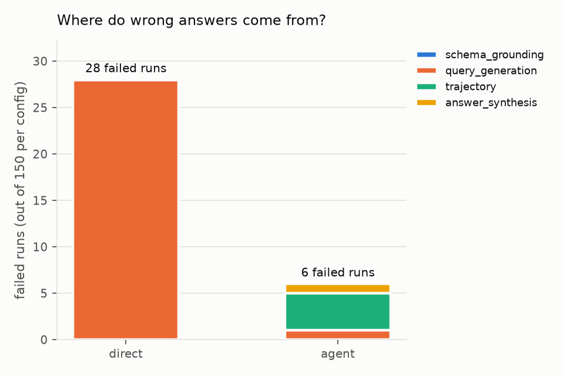
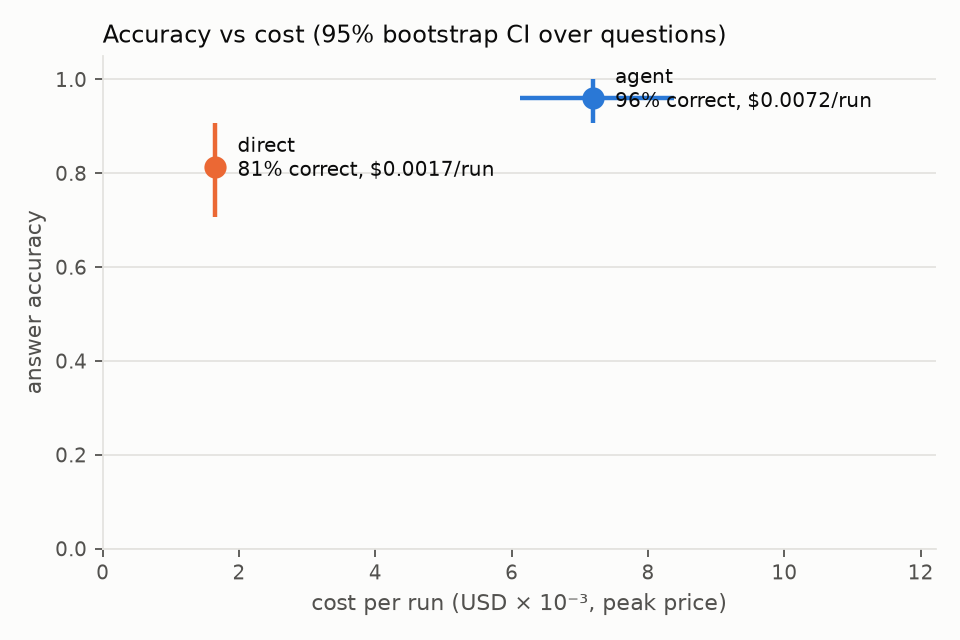

# NetGraph-Eval

**Evaluating a ReAct-style Text-to-Cypher agent on a synthetic telecom network graph.**

An LLM agent that inspects the schema, writes Cypher, reads the result and corrects itself — evaluated
on a small Neo4j knowledge graph that mimics a fixed telecom network. The project asks:

1. **Where** does the agent fail: schema grounding, query generation, trajectory, or answer synthesis?
2. Which **label-free signals** detect deliberate degradations (prompt, schema, model)?
3. Is the agent **worth its cost** compared to a one-shot text-to-Cypher pipeline?

> **Synthetic data; not affiliated with KPN.** The graph is generated by `src/netgraph/graph_gen.py`
> and is loosely inspired by public project descriptions mentioning a "fixed-network knowledge graph".
> It contains no real network or customer data.

## Main result (50 questions × 3 repeats per config, DeepSeek-V4-Pro, temperature 0)

| | one-shot `direct` | ReAct `agent` |
|---|---|---|
| Answer accuracy (95% CI) | 0.81 [0.71, 0.91] | **0.96** [0.91, 1.00] |
| … on `impact` questions (variable-length paths) | 0.37 | **0.90** |
| … on `multi_hop` questions | 0.70 | **0.90** |
| Correct in all 3 repeats (pass^3) | 0.76 | 0.94 |
| Avg tokens per run | 1,098 | 4,938 |
| Cost per successful task (USD, peak price) | **0.0020** | 0.0075 (3.7×) |
| Failed runs: query generation / trajectory / answer synthesis | 28 / 0 / 0 | 1 / 4 / 1 |

CIs: bootstrap over questions. Full table: `results/tables/main.csv`. Failure stages are assigned
by heuristic rules (`src/netgraph/grading.py`). Regenerate everything with
`uv run python scripts/make_report_assets.py`.




## Quick start

```bash
cp .env.example .env              # 1. set NEO4J_PASSWORD and your LLM API key
docker compose up -d              # 2. start Neo4j (browser: http://localhost:7474)
uv sync && uv run pytest          # 3. install deps and run the smoke tests
```

Run only the offline tests (no database, no API cost): `uv run pytest -m "not neo4j and not llm"`.

## Known limitation: read-only access

Neo4j Community Edition has no role-based access control, so the agent cannot be given a truly
read-only database user. Instead `src/netgraph/db.py` (1) rejects queries containing write keywords
(`CREATE`, `MERGE`, `DELETE`, `SET`, `REMOVE`, `DROP`, `LOAD CSV`, `CALL dbms`, …) and (2) runs every
agent query inside a read transaction with a 5 s timeout and a 50-row cap.

## Repository layout

```text
configs/   models, prices, prompts, value assumptions (copied into every run manifest)
data/      benchmark.jsonl, review_log.csv, human_ratings.csv
src/       netgraph package: db, llm, graph_gen, agent, baseline, trace, grading, judge, analysis
scripts/   build_graph.py, run_experiment.py, make_report_assets.py
results/   raw/ (append-only traces), tables/, figures/, manifests/
docs/      report.md, metric_taxonomy.md, schema.md, benchmark_review.md
```

