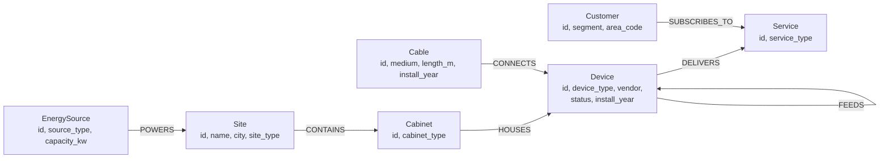

# Graph schema

Synthetic fixed-network graph generated by `src/netgraph/graph_gen.py` (seed 42).
Rebuild with `uv run python scripts/build_graph.py`.



## Topology

```text
datacenter (2)       core_router  x2 each ─┐
central_office (6)   agg_switch   x2 each ─┤  FEEDS (tree, each device has one parent)
street_site (12)     olt          x2 each ─┤
customer premises    ont          3–5 per OLT, one customer each (not housed in a cabinet)
```

- Every FEEDS link has one Cable that CONNECTS both devices. 15 % of OLT→ONT cables are copper.
- Each city's agg switches hang off the core routers of one datacenter
  (Amsterdam DC: Amsterdam, Utrecht, Groningen; Rotterdam DC: Rotterdam, Den Haag, Eindhoven).
- Every site has a `grid` source; datacenters also a `generator`; 4 other sites a `battery`.
- ~5 % of devices are not active (half `maintenance`, half `failed`).
- Consumers get `internet` (+ `tv` 40 %); business customers get `business_vpn` (+ `internet` 50 %).
- Site names `Kerkstraat`, `Marktplein`, `Stationsplein` each exist in two cities (ambiguity).

## Counts (seed 42)

| Node | Count | | Relationship | Count |
|---|---:|---|---|---:|
| Device | 138 | | CONNECTS | 268 |
| Service | 148 | | SUBSCRIBES_TO | 148 |
| Cable | 134 | | DELIVERS | 148 |
| Customer | 98 | | FEEDS | 134 |
| Cabinet | 28 | | HOUSES | 40 |
| EnergySource | 26 | | CONTAINS | 28 |
| Site | 20 | | POWERS | 26 |
| **Total** | **592** | | **Total** | **792** |
